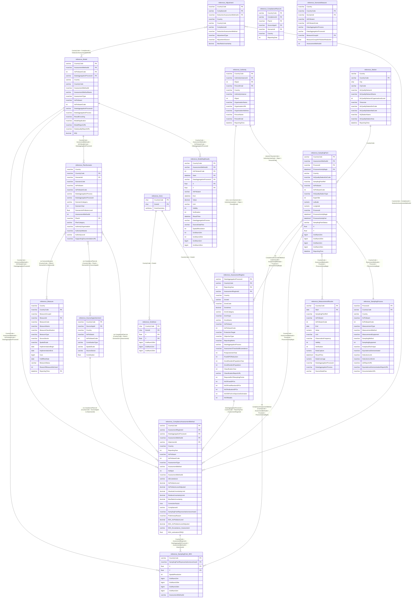

```mermaid
erDiagram
    reference_Adjustment {
    nvarchar CountryCode PK
    varchar ComplianceId PK
    nvarchar DeductionAssessmentMethodId PK
    nvarchar Country
    varchar CountryCode
    varchar ComplianceId
    nvarchar DeductionAssessmentMethod
    nvarchar AdjustmentType
    nvarchar AdjustmentSource
    decimal MaxRatioUncertainty
    }
    reference_Adjustment }o--o{ reference_ComplianceAssessmentMethod : "CountryCode + ComplianceId + DeductionAssessmentMethodId"
    reference_Adjustment }o--o{ reference_Model : "CountryCode + ComplianceId + DeductionAssessmentMethodId"

    %% reference_AdminBoundaryGrid {
    %% smallint adm_id
    %% bigint GridNum100m
    %% bigint GridNum10km
    %% bigint GridNum1km
    %% int Year
    %% int Population
    %% }
    %% reference_AdminBoundaryLookup_adm_eea39_2021 {
    %% smallint adm_id
    %% nvarchar ICC
    %% nvarchar adm_country
    %% nvarchar level3_name
    %% nvarchar level2_name
    %% nvarchar level1_name
    %% nvarchar level0_name
    %% nvarchar level3_code
    %% nvarchar level2_code
    %% nvarchar level1_code
    %% nvarchar level0_code
    %% bit EEA32_2020
    %% bit EEA38_2020
    %% bit EEA39
    %% bit EEA33
    %% bit eea32
    %% bit eu27_nouk
    %% bit EU28
    %% bit eu27
    %% bit EU25
    %% bit EU15
    %% bit EU12
    %% bit EU10
    %% tinyint EFTA4
    %% nvarchar NUTS_EU
    %% nvarchar TAA
    %% }
    reference_AssessmentRegime {
    varchar DataAggregationProcessId PK
    varchar CountryCode PK
    int ReportingYear PK
    varchar AssessmentRegimeId PK
    nvarchar Country
    varchar ZoneId
    nvarchar ZoneCode
    decimal ZoneArea
    varchar ZoneCategory
    nvarchar ZoneType
    varchar ZoneName
    nvarchar AirPollutant
    int AirPollutantCode
    nvarchar ProtectionTarget
    nvarchar ObjectiveType
    nvarchar ReportingMetric
    varchar DataAggregationProcess
    nvarchar AssessmentThresholdExceedance
    int PostponementYear
    int FixedSPOReduction
    int ZoneResidentPopulationYear
    int ZoneResidentPopulation
    int ClassificationYear
    varchar ClassificationReportURL
    int RequiredNrOfSamplingPoints
    int NrOfFixedSPOs
    int NrOfFixedRandomSPOs
    int NrOfIndicativeSPOs
    int NrOfSPOsForObjectiveEstimation
    int NrOfModels
    }
    reference_AssessmentRegime ||--o{ reference_ComplianceAssessmentMethod : "DataAggregationProcessId + CountryCode + ReportingYear + AssessmentRegimeId"
    reference_Authority {
    nvarchar CountryCode PK
    nvarchar AuthorityInstanceId PK
    int Object PK
    nvarchar PersonEmail PK
    nvarchar Country
    nvarchar AuthorityInstance
    int Object
    nvarchar OrganisationName
    nvarchar OrganisationURL
    nvarchar OrganisationAddress
    nvarchar PersonName
    nvarchar PersonEmail
    datetime ReportingTime
    }
    reference_Authority ||--o{ reference_SamplingPoint : "network (CountryCode + AuthorityInstanceId + Object + PersonEmail)"
    reference_Authority ||--o{ reference_AssessmentRegime : "zone, nuts (CountryCode + AuthorityInstanceId + Object + PersonEmail)"
    reference_ComplianceAssessmentMethod {
    varchar CountryCode PK
    varchar AssessmentRegimeId PK
    varchar DataAggregationProcessId PK
    nvarchar AssessmentMethodId PK
    varchar AttainmentId PK
    nvarchar Country
    int ReportingYear
    nvarchar AirPollutant
    int AirPollutantCode
    nvarchar AssessmentType
    varchar AssessmentMethod
    int HotSpot
    nvarchar AssessmentMethodId
    varchar IsExceedance
    decimal AirPollutionLevel
    decimal AirPollutionLevelAdjusted
    decimal AbsoluteUncertaintyLimit
    decimal RelativeUncertaintyLimit
    decimal MaxRatioUncertainty
    char CorrectionFactor
    varchar ComplianceId
    nvarchar SamplingPointRepresentativenessAreaId
    nvarchar PreliminaryReason
    decimal EEA_AirPollutionLevel
    decimal EEA_AirPollutionLevelAdjusted
    varchar EEA_Exceedance_Assessment
    float EEA_estimationOfMQI
    }
    reference_ComplianceAssessmentMethod ||--o{ reference_SamplingPoint_SRA : "CountryCode + AssessmentRegimeId + DataAggregationProcessId + AssessmentMethodId + AttainmentId"
    %% Ambiguity: The document mentions a relation to "PLAN", but no table named "PLAN" exists. It might refer to "reference_PlanScenario" or another table. This needs clarification before adding the relationship.
    reference_CompliancePlanLink {
    varchar CountryCode PK
    varchar ComplianceId PK
    nvarchar PlanId PK
    nvarchar SourceAppId PK
    nvarchar ScenarioId PK
    nvarchar Country
    int ReportingYear
    }
    reference_GridZone {
    char CountryCode PK
    char ZoneId PK
    float X PK
    float Y PK
    bigint GridNum100m
    bigint GridNum1km
    bigint GridNum10km
    }
    reference_Measure {
    nvarchar Country
    nvarchar CountryCode PK
    nvarchar MeasureGroupId
    nvarchar MeasureId PK
    nvarchar MeasureCode
    nvarchar MeasureName
    nvarchar MeasureClassification
    nvarchar MeasureType
    nvarchar SourceSector
    nvarchar SpatialScale
    date ImplementationBegin
    date ImplementationEnd
    bigint Cost
    date FullEffectDate
    varchar MeasureStatus
    int ReasonIfMeasureNotUsed
    datetime ReportingTime PK
    }
    reference_MeasurementResults {
    varchar CountryCode PK
    date Start PK
    nvarchar SamplingPointRef
    nvarchar AirPollutant
    int AirPollutantCode
    date End
    numeric Value
    nvarchar Unit
    nvarchar ObservationFrequency
    int Validity
    int Verification
    numeric DataCapture
    datetime2 ResultTime
    numeric DataCoverage
    nvarchar DataAggregationProcessId
    nvarchar DataAggregationProcess
    varchar SourceDataFlow
    }
    reference_Model {
    varchar CountryCode PK
    nvarchar AssessmentMethodId PK
    int AirPollutantCode PK
    varchar DataAggregationProcessId PK
    varchar Country
    varchar CountryCode
    nvarchar AssessmentMethodId
    varchar AssessmentMethodName
    nvarchar AssessmentType
    nvarchar AirPollutant
    int AirPollutantCode
    varchar DataAggregationProcessId
    nvarchar DataAggregationProcess
    nvarchar ResultEncoding
    nvarchar ModelApplication
    nvarchar ModelReportURL
    nvarchar DataQualityReportURL
    decimal MQI
    }
    reference_Model ||--o{ reference_ModellingResults : "CountryCode + AssessmentMethodId + AirPollutantCode + DataAggregationProcessId"
    reference_Model ||--o{ reference_PlanScenario : "CountryCode + AssessmentMethodId + AirPollutantCode + DataAggregationProcessId"
    reference_Model ||--o{ reference_ComplianceAssessmentMethod : "CountryCode + AssessmentMethodId + AirPollutantCode + DataAggregationProcessId"
    reference_Model ||--o{ reference_SamplingPoint_SRA : "CountryCode + AssessmentMethodId + AirPollutantCode + DataAggregationProcessId"
    reference_ModellingResults {
    varchar CountryCode PK
    varchar AssessmentMethodId PK
    int AirPollutantCode PK
    datetime Start PK
    varchar DataAggregationProcessId PK
    float X PK
    float Y PK
    varchar AirPollutant
    datetime End
    decimal Value
    varchar Unit
    int Validity
    int Verification
    datetime ResultTime
    varchar DataAggregationProcess
    varchar SourceDataFlow
    int SpatialResolution
    int GridNum10m
    int GridNum100m
    bigint GridNum1km
    bigint GridNum10km
    }
    reference_PlanScenario {
    nvarchar Country
    nvarchar CountryCode PK
    nvarchar ScenarioId PK
    nvarchar ScenarioCode
    nvarchar AirPollutant
    nvarchar AirPollutantCode
    varchar DataAggregationProcess
    varchar DataAggregationProcessId
    varchar ScenarioCategory
    int ScenarioYear
    float ScenarioAirPollutionLevel
    int AssessmentMethodId
    nvarchar PlanId PK
    varchar PlanCategory
    nvarchar AuthorityOrganisation
    nvarchar AuthorityWebsite
    varchar AuthorityLevel
    nvarchar SupportingDocumentationURL
    }
    reference_PlanScenario }o--o{ reference_ComplianceAssessmentMethod : "via CompliancePlanLink (CountryCode + PlanId + ScenarioId to AttainmentId)"
    reference_PlanScenario }o--o{ reference_SourceApportionment : "via CompliancePlanLink (CountryCode + PlanId + ScenarioId to SourceAppId)"
    reference_PlanScenario }o--o{ reference_Measure : "via ScenarioMeasure (CountryCode + PlanId + ScenarioId to MeasureId)"
    reference_SamplingPoint {
    varchar CountryCode PK
    nvarchar AssessmentMethodId PK
    nvarchar ProcessId PK
    datetime2 ProcessActivityBegin PK
    varchar Country
    nvarchar AirQualityStationEoICode
    nvarchar SamplingPointRef
    nvarchar AirPollutant
    int AirPollutantCode
    nvarchar AirQualityStationType
    int SuperSite
    numeric Latitude
    numeric Longitude
    nvarchar ProcessId
    datetime2 ProcessActivityBegin
    datetime2 ProcessActivityEnd
    varchar SamplingPointStatus
    float X
    float Y
    bigint GridNum10m
    bigint GridNum100m
    bigint GridNum1km
    bigint GridNum10km
    datetime ReportingTime
    }
    reference_SamplingPoint ||--|| reference_SamplingProcess : "CountryCode + AssessmentMethodId + ProcessId + ProcessActivityBegin"
    reference_SamplingPoint }o--o{ reference_MeasurementResults : "CountryCode + AssessmentMethodId + ProcessId + ProcessActivityBegin"
    reference_SamplingPoint }o--o{ reference_ComplianceAssessmentMethod : "CountryCode + AssessmentMethodId + ProcessId + ProcessActivityBegin"
    reference_SamplingPoint }o--o{ reference_AssessmentRegime : "via ComplianceAssessmentMethod (CountryCode + AssessmentMethodId + ProcessId + ProcessActivityBegin)"
    reference_SamplingPoint }o--o{ reference_SamplingPoint_SRA : "via ComplianceAssessmentMethod (CountryCode + AssessmentMethodId + ProcessId + ProcessActivityBegin)"
    reference_SamplingPoint_SRA {
    varchar CountryCode PK
    nvarchar SamplingPointRepresentativenessAreaId PK
    float X PK
    float Y PK
    int SpatialResolution
    bigint GridNum10m
    bigint GridNum100m
    bigint GridNum10km
    bigint GridNum1km
    varchar AssessmentMethodId
    }
    reference_SamplingProcess {
    nvarchar ProcessId PK
    varchar CountryCode PK
    varchar Country
    nvarchar AirPollutant
    int AirPollutantCode
    nvarchar MeasurementType
    nvarchar MeasurementMethod
    nvarchar MeasurementEquipment
    nvarchar SamplingMethod
    int SamplingEquipment
    nvarchar AnalyticalTechnique
    nvarchar EquivalenceDemonstrated
    nvarchar DetectionLimit
    nvarchar DetectionLimitUnit
    nvarchar QAReportURL
    nvarchar EquivalenceDemonstrationReportURL
    nvarchar DocumentationURL
    }
    reference_ScenarioMeasure {
    nvarchar Country
    nvarchar CountryCode PK
    nvarchar ScenarioId PK
    nvarchar AirPollutant
    nvarchar AirPollutantCode
    varchar DataAggregationProcess
    varchar DataAggregationProcessId
    nvarchar MeasureGroupId PK
    float MeasureGroupAirPollutionReduction
    int AssessmentMethodId
    }
    reference_SourceApportionment {
    nvarchar CountryCode PK
    nvarchar SourceAppId PK
    nvarchar Country
    nvarchar AirPollutant
    int AirPollutantCode
    varchar ContributionType
    varchar SpatialScale
    varchar SourceSector
    float Contribution
    }
    reference_SourceApportionment ||--o{ reference_ComplianceAssessmentMethod : "via CompliancePlanLink (CountryCode + SourceAppId to AttainmentId)"
    %% Note: The relationship is mediated through the CompliancePlanLink table. Each SourceApportionment may apply to several AttainmentIds, but each AttainmentId should only have one SourceApportionment.
    reference_Station {
    varchar Country
    varchar CountryCode PK
    char City
    varchar CityCode
    nvarchar AirQualityNetwork
    nvarchar AirQualityNetworkName
    int AirQualityNetworkOrganisationalLevel
    nvarchar Timezone
    nvarchar AirQualityStationEoICode
    nvarchar AirQualityStationNatCode
    nvarchar AQStationName
    nvarchar AirQualityStationArea
    datetime ReportingTime
    }
    reference_Station ||--o{ reference_SamplingPoint : "CountryCode"
    %% reference_Vocabulary {
    %% varchar vocabulary
    %% varchar Notation
    %% varchar URI
    %% varchar Label
    %% varchar Definition
    %% varchar Note
    %% varchar Status
    %% date StatusModifiedDate
    %% date AcceptedDate
    %% date NotAcceptedDate
    %% }
    %% reference_VocabularyRelations {
    %% varchar Vocabulary
    %% varchar RelatedVocabulary
    %% varchar Concept_notation
    %% varchar Related_notation
    %% }
    reference_Zone {
    char CountryCode PK
    char ZoneId PK
    varbinary ZoneGeometry
    }
    reference_Zone ||--o{ reference_AssessmentRegime : "CountryCode + ZoneId"
    reference_Zone ||--o{ reference_GridZone : "CountryCode + ZoneId"
```