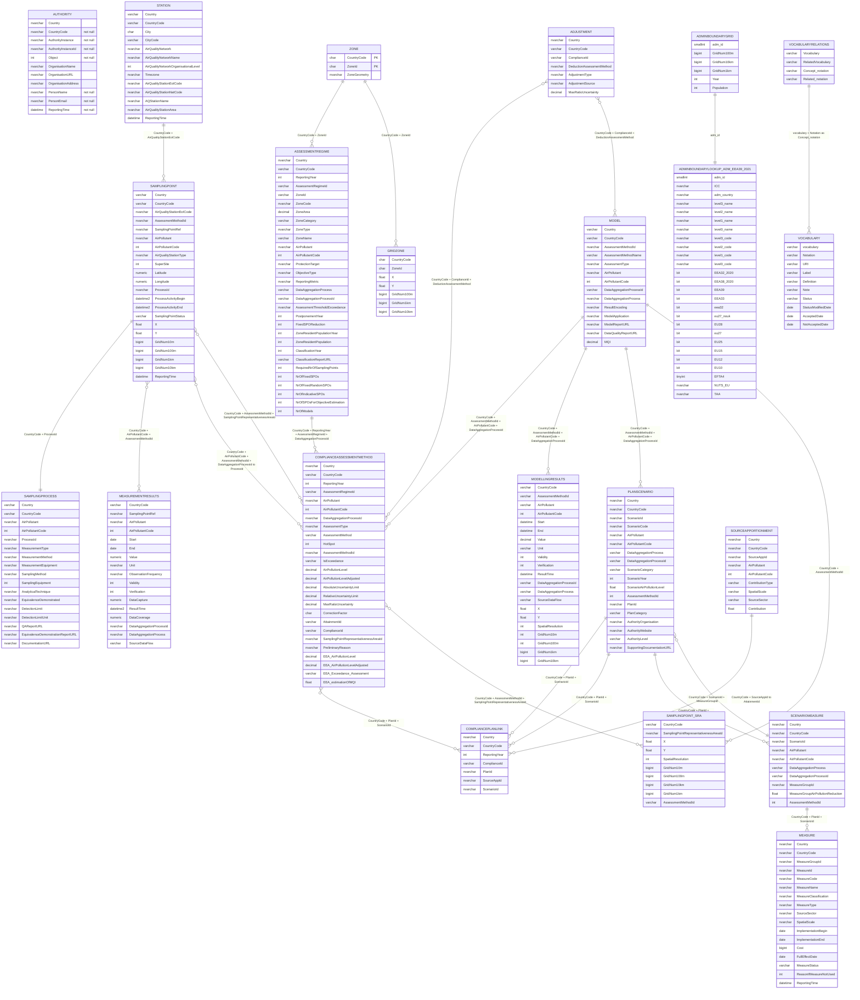

```mermaid
erDiagram

AUTHORITY {
    nvarchar Country
    nvarchar CountryCode "not null"
    nvarchar AuthorityInstance "not null"
    nvarchar AuthorityInstanceId "not null"
    int Object "not null"
    nvarchar OrganisationName
    nvarchar OrganisationURL
    nvarchar OrganisationAddress
    nvarchar PersonName "not null"
    nvarchar PersonEmail "not null"
    datetime ReportingTime "not null"
}

STATION {
    varchar Country
    varchar CountryCode
    char City
    varchar CityCode
    nvarchar AirQualityNetwork
    nvarchar AirQualityNetworkName
    int AirQualityNetworkOrganisationalLevel
    nvarchar Timezone
    nvarchar AirQualityStationEoICode
    nvarchar AirQualityStationNatCode
    nvarchar AQStationName
    nvarchar AirQualityStationArea
    datetime ReportingTime
}
STATION ||--o{ SAMPLINGPOINT : "CountryCode + AirQualityStationEoICode"

SAMPLINGPOINT {
    varchar Country
    varchar CountryCode
    nvarchar AirQualityStationEoICode
    nvarchar AssessmentMethodId
    nvarchar SamplingPointRef
    nvarchar AirPollutant
    int AirPollutantCode
    nvarchar AirQualityStationType
    int SuperSite
    numeric Latitude
    numeric Longitude
    nvarchar ProcessId
    datetime2 ProcessActivityBegin
    datetime2 ProcessActivityEnd
    varchar SamplingPointStatus
    float X
    float Y
    bigint GridNum10m
    bigint GridNum100m
    bigint GridNum1km
    bigint GridNum10km
    datetime ReportingTime
}
SAMPLINGPOINT ||--|| SAMPLINGPROCESS : "CountryCode + ProcessId"
SAMPLINGPOINT }o--o{ MEASUREMENTRESULTS : "CountryCode + AirPollutantCode + AssessmentMethodId"
SAMPLINGPOINT }o--o{ COMPLIANCEASSESSMENTMETHOD : "CountryCode + AirPollutantCode + AssessmentMethodId + DataAggregationProcessId to ProcessId"

SAMPLINGPROCESS {
    varchar Country
    varchar CountryCode
    nvarchar AirPollutant
    int AirPollutantCode
    nvarchar ProcessId
    nvarchar MeasurementType
    nvarchar MeasurementMethod
    nvarchar MeasurementEquipment
    nvarchar SamplingMethod
    int SamplingEquipment
    nvarchar AnalyticalTechnique
    nvarchar EquivalenceDemonstrated
    nvarchar DetectionLimit
    nvarchar DetectionLimitUnit
    nvarchar QAReportURL
    nvarchar EquivalenceDemonstrationReportURL
    nvarchar DocumentationURL
}

MEASUREMENTRESULTS {
    varchar CountryCode
    nvarchar SamplingPointRef
    nvarchar AirPollutant
    int AirPollutantCode
    date Start
    date End
    numeric Value
    nvarchar Unit
    nvarchar ObservationFrequency
    int Validity
    int Verification
    numeric DataCapture
    datetime2 ResultTime
    numeric DataCoverage
    nvarchar DataAggregationProcessId
    nvarchar DataAggregationProcess
    varchar SourceDataFlow
}

SAMPLINGPOINT_SRA {
    varchar CountryCode
    nvarchar SamplingPointRepresentativenessAreaId
    float X
    float Y
    int SpatialResolution
    bigint GridNum10m
    bigint GridNum100m
    bigint GridNum10km
    bigint GridNum1km
    varchar AssessmentMethodId
}
SAMPLINGPOINT }o--o{ COMPLIANCEASSESSMENTMETHOD : "CountryCode + AssessmentMethodId + SamplingPointRepresentativenessAreaId"

MODELLINGRESULTS {
    varchar CountryCode
    varchar AssessmentMethodId
    varchar AirPollutant
    int AirPollutantCode
    datetime Start
    datetime End
    decimal Value
    varchar Unit
    int Validity
    int Verification
    datetime ResultTime
    varchar DataAggregationProcessId
    varchar DataAggregationProcess
    varchar SourceDataFlow
    float X
    float Y
    int SpatialResolution
    int GridNum10m
    int GridNum100m
    bigint GridNum1km
    bigint GridNum10km
}

MODEL {
    varchar Country
    varchar CountryCode
    nvarchar AssessmentMethodId
    varchar AssessmentMethodName
    nvarchar AssessmentType
    nvarchar AirPollutant
    int AirPollutantCode
    varchar DataAggregationProcessId
    nvarchar DataAggregationProcess
    nvarchar ResultEncoding
    nvarchar ModelApplication
    nvarchar ModelReportURL
    nvarchar DataQualityReportURL
    decimal MQI
}
MODEL ||--o{ COMPLIANCEASSESSMENTMETHOD : "CountryCode + AssessmentMethodId + AirPollutantCode + DataAggregationProcessId"
MODEL ||--o{ MODELLINGRESULTS : "CountryCode + AssessmentMethodId + AirPollutantCode + DataAggregationProcessId"
MODEL ||--o{ PLANSCENARIO : "CountryCode + AssessmentMethodId + AirPollutantCode + DataAggregationProcessId"
MODEL ||--o{ SAMPLINGPOINT_SRA : "CountryCode + AssessmentMethodId"

ZONE {
    char CountryCode PK
    char ZoneId PK
    nvarchar ZoneGeometry
}
ZONE ||--o{ ASSESSMENTREGIME : "CountryCode + ZoneId"
ZONE ||--o{ GRIDZONE : "CountryCode + ZoneId"

GRIDZONE {
    char CountryCode
    char ZoneId
    float X
    float Y
    bigint GridNum100m
    bigint GridNum1km
    bigint GridNum10km
}

ASSESSMENTREGIME {
    nvarchar Country
    varchar CountryCode
    int ReportingYear
    varchar AssessmentRegimeId
    varchar ZoneId
    nvarchar ZoneCode
    decimal ZoneArea
    varchar ZoneCategory
    nvarchar ZoneType
    varchar ZoneName
    nvarchar AirPollutant
    int AirPollutantCode
    nvarchar ProtectionTarget
    nvarchar ObjectiveType
    nvarchar ReportingMetric
    varchar DataAggregationProcess
    varchar DataAggregationProcessId
    nvarchar AssessmentThresholdExceedance
    int PostponementYear
    int FixedSPOReduction
    int ZoneResidentPopulationYear
    int ZoneResidentPopulation
    int ClassificationYear
    varchar ClassificationReportURL
    int RequiredNrOfSamplingPoints
    int NrOfFixedSPOs
    int NrOfFixedRandomSPOs
    int NrOfIndicativeSPOs
    int NrOfSPOsForObjectiveEstimation
    int NrOfModels
}
ASSESSMENTREGIME ||--o{ COMPLIANCEASSESSMENTMETHOD : "CountryCode + ReportingYear + AssessmentRegimeId + DataAggregationProcessId"

COMPLIANCEASSESSMENTMETHOD {
    nvarchar Country
    varchar CountryCode
    int ReportingYear
    varchar AssessmentRegimeId
    nvarchar AirPollutant
    int AirPollutantCode
    nvarchar DataAggregationProcessId
    nvarchar AssessmentType
    varchar AssessmentMethod
    int HotSpot
    nvarchar AssessmentMethodId
    varchar IsExceedance
    decimal AirPollutionLevel
    decimal AirPollutionLevelAdjusted
    decimal AbsoluteUncertaintyLimit
    decimal RelativeUncertaintyLimit
    decimal MaxRatioUncertainty
    char CorrectionFactor
    varchar AttainmentId
    varchar ComplianceId
    nvarchar SamplingPointRepresentativenessAreaId
    nvarchar PreliminaryReason
    decimal EEA_AirPollutionLevel
    decimal EEA_AirPollutionLevelAdjusted
    varchar EEA_Exceedance_Assessment
    float EEA_estimationOfMQI
}
COMPLIANCEASSESSMENTMETHOD }o--o{ COMPLIANCEPLANLINK : "CountryCode + PlanId + ScenarioId"
COMPLIANCEASSESSMENTMETHOD }o--o{ SAMPLINGPOINT_SRA : "CountryCode + AssessmentMethodId + SamplingPointRepresentativenessAreaId"

ADJUSTMENT {
    nvarchar Country
    varchar CountryCode
    varchar ComplianceId
    nvarchar DeductionAssessmentMethod
    nvarchar AdjustmentType
    nvarchar AdjustmentSource
    decimal MaxRatioUncertainty
}
ADJUSTMENT }o--o{ COMPLIANCEASSESSMENTMETHOD : "CountryCode + ComplianceId + DeductionAssessmentMethod"
ADJUSTMENT }o--o{ MODEL : "CountryCode + ComplianceId + DeductionAssessmentMethod"

PLANSCENARIO {
    nvarchar Country
    nvarchar CountryCode
    nvarchar ScenarioId
    nvarchar ScenarioCode
    nvarchar AirPollutant
    nvarchar AirPollutantCode
    varchar DataAggregationProcess
    varchar DataAggregationProcessId
    varchar ScenarioCategory
    int ScenarioYear
    float ScenarioAirPollutionLevel
    int AssessmentMethodId
    nvarchar PlanId
    varchar PlanCategory
    nvarchar AuthorityOrganisation
    nvarchar AuthorityWebsite
    varchar AuthorityLevel
    nvarchar SupportingDocumentationURL
}
PLANSCENARIO ||--o{ COMPLIANCEPLANLINK : "CountryCode + PlanId + ScenarioId"
PLANSCENARIO ||--o{ COMPLIANCEPLANLINK : "CountryCode + PlanId + ScenarioId"
PLANSCENARIO ||--o{ SCENARIOMEASURE : "CountryCode + PlanId + ScenarioId"

COMPLIANCEPLANLINK {
    nvarchar Country
    varchar CountryCode
    int ReportingYear
    varchar ComplianceId
    nvarchar PlanId
    nvarchar SourceAppId
    nvarchar ScenarioId
}

MEASURE {
    nvarchar Country
    nvarchar CountryCode
    nvarchar MeasureGroupId
    nvarchar MeasureId
    nvarchar MeasureCode
    nvarchar MeasureName
    nvarchar MeasureClassification
    nvarchar MeasureType
    nvarchar SourceSector
    nvarchar SpatialScale
    date ImplementationBegin
    date ImplementationEnd
    bigint Cost
    date FullEffectDate
    varchar MeasureStatus
    int ReasonIfMeasureNotUsed
    datetime ReportingTime
}

SCENARIOMEASURE {
    nvarchar Country
    nvarchar CountryCode
    nvarchar ScenarioId
    nvarchar AirPollutant
    nvarchar AirPollutantCode
    varchar DataAggregationProcess
    varchar DataAggregationProcessId
    nvarchar MeasureGroupId
    float MeasureGroupAirPollutionReduction
    int AssessmentMethodId
}
SCENARIOMEASURE ||--o{ PLANSCENARIO : "CountryCode + ScenarioId + MeasureGroupId"
SCENARIOMEASURE ||--o{ MEASURE : "CountryCode + PlanId + ScenarioId"

SOURCEAPPORTIONMENT {
    nvarchar Country
    nvarchar CountryCode
    nvarchar SourceAppId
    nvarchar AirPollutant
    int AirPollutantCode
    varchar ContributionType
    varchar SpatialScale
    varchar SourceSector
    float Contribution
}
SOURCEAPPORTIONMENT ||--o{ COMPLIANCEPLANLINK : "CountryCode + SourceAppId to AttainmentId"

ADMINBOUNDARYGRID {
    smallint adm_id
    bigint GridNum100m
    bigint GridNum10km
    bigint GridNum1km
    int Year
    int Population
}
ADMINBOUNDARYGRID ||--|| ADMINBOUNDARYLOOKUP_ADM_EEA39_2021 : "adm_id"

ADMINBOUNDARYLOOKUP_ADM_EEA39_2021 {
    smallint adm_id
    nvarchar ICC
    nvarchar adm_country
    nvarchar level3_name
    nvarchar level2_name
    nvarchar level1_name
    nvarchar level0_name
    nvarchar level3_code
    nvarchar level2_code
    nvarchar level1_code
    nvarchar level0_code
    bit EEA32_2020
    bit EEA38_2020
    bit EEA39
    bit EEA33
    bit eea32
    bit eu27_nouk
    bit EU28
    bit eu27
    bit EU25
    bit EU15
    bit EU12
    bit EU10
    tinyint EFTA4
    nvarchar NUTS_EU
    nvarchar TAA
}

VOCABULARYRELATIONS {
    varchar Vocabulary
    varchar RelatedVocabulary
    varchar Concept_notation
    varchar Related_notation
}
VOCABULARYRELATIONS ||--o{ VOCABULARY : "vocabulary + Notation as Concept_notation"

VOCABULARY {
    varchar vocabulary
    varchar Notation
    varchar URI
    varchar Label
    varchar Definition
    varchar Note
    varchar Status
    date StatusModifiedDate
    date AcceptedDate
    date NotAcceptedDate
}
```

