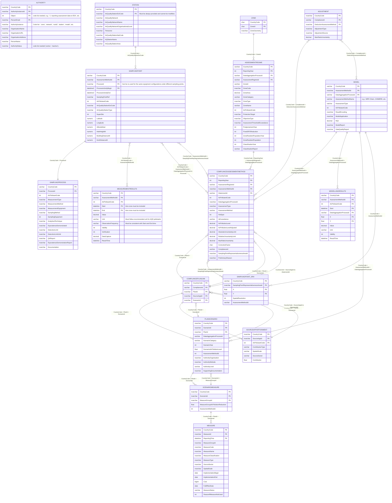

```mermaid
erDiagram

AUTHORITY {
    nvarchar CountryCode PK
    nvarchar AuthorityInstanceId PK
    int Object PK "code list needed, e.g.: ‘1: reporting assessment data to EEA’, etc."
    nvarchar PersonEmail PK
    nvarchar AuthorityInstance "Code list : ‘zone’, ‘network’, ‘nuts0’, ‘station’, ‘model’, etc."
    nvarchar OrganisationName
    nvarchar OrganisationURL
    nvarchar OrganisationAddress
    nvarchar PersonName
    nvarchar AuthorityStatus "code list needed (‘active’, ‘inactive’).​"
}

STATION {
    varchar CountryCode PK
    nvarchar AirQualityStationEoICode PK "Must be always provided and cannot be modified,​"
    nvarchar AirQualityNetwork
    nvarchar AirQualityNetworkName
    nvarchar AirQualityNetworkOrganisationalLevel
    nvarchar Timezone
    nvarchar AirQualityStationNatCode
    nvarchar AQStationName
    nvarchar AirQualityStationArea
}
STATION ||--o{ SAMPLINGPOINT : "CountryCode + AirQualityStationEoICode"

SAMPLINGPOINT {
    varchar CountryCode PK
    nvarchar AssessmentMethodId PK
    nvarchar ProcessId PK "Can be re-used for the same equipment configurations under different sampling points."
    datetime2 ProcessActivityBegin PK
    datetime2 ProcessActivityEnd
    nvarchar SamplingPointRef
    int AirPollutantCode
    nvarchar AirQualityStationEoICode
    nvarchar AirQualityStationType
    int SuperSite
    numeric Latitude
    numeric Longitude
    numeric AltitudeMasl
    numeric InletHeightM
    numeric BuildingDistanceM
    numeric KerbDistanceM
}

SAMPLINGPOINT ||--|| SAMPLINGPROCESS : "CountryCode + ProcessId"
SAMPLINGPOINT }o--o{ MEASUREMENTRESULTS : "CountryCode + AirPollutantCode + AssessmentMethodId"
SAMPLINGPOINT }o--o{ COMPLIANCEASSESSMENTMETHOD : "CountryCode + AirPollutantCode + AssessmentMethodId + DataAggregationProcessId to ProcessId"

SAMPLINGPROCESS {
    varchar CountryCode PK
    nvarchar ProcessId PK
    int AirPollutantCode
    nvarchar MeasurementType
    nvarchar MeasurementMethod
    nvarchar MeasurementEquipment
    nvarchar SamplingMethod
    int SamplingEquipment
    nvarchar AnalyticalTechnique
    nvarchar EquivalenceDemonstrated
    nvarchar DetectionLimit
    nvarchar DetectionLimitUnit
    nvarchar QAReport
    nvarchar EquivalenceDemonstrationReport
    nvarchar Documentation
}

MEASUREMENTRESULTS {
    varchar CountryCode PK
    varchar AssessmentMethodId PK
    int AirPollutantCode PK
    datetime Start PK "time zone must be included"
    datetime End PK "time zone must be included"
    decimal Value
    varchar Unit "Must follow recommended unit for AQD pollutants"
    varchar ObservationFrequency "Must be consistent with Start and End time"
    int Validity
    int Verification
    decimal DataCapture
    datetime ResultTime
}

SAMPLINGPOINT_SRA {
    varchar CountryCode PK
    nvarchar SamplingPointRepresentativenessAreaId PK
    float X PK
    float Y PK
    int SpatialResolution
    varchar AssessmentMethodId
}
SAMPLINGPOINT }o--o{ COMPLIANCEASSESSMENTMETHOD : "CountryCode + AssessmentMethodId + SamplingPointRepresentativenessAreaId"

MODELLINGRESULTS {
    varchar CountryCode PK
    varchar AssessmentMethodId PK
    int AirPollutantCode PK
    datetime Start PK
    varchar DataAggregationProcessId PK
    float X PK
    float Y PK
    decimal Value
    varchar Unit
    int Validity
    datetime ResultTime
}

MODEL {
    varchar CountryCode PK
    nvarchar AssessmentMethodId PK
    varchar DataAggregationProcessId PK
    varchar AssessmentMethodName "e.g.: WRF-Chem, CHIMERE, etc."
    varchar AssessmentType
    int AirPollutantCode
    nvarchar ResultEncoding
    nvarchar ModelApplication
    decimal MQI
    nvarchar ModelReport
    nvarchar DataQualityReport
}
MODEL ||--o{ COMPLIANCEASSESSMENTMETHOD : "CountryCode + AssessmentMethodId + DataAggregationProcessId"
MODEL ||--o{ MODELLINGRESULTS : "CountryCode + AssessmentMethodId + DataAggregationProcessId"
MODEL ||--o{ PLANSCENARIO : "CountryCode + AssessmentMethodId + DataAggregationProcessId"
MODEL ||--o{ SAMPLINGPOINT_SRA : "CountryCode + AssessmentMethodId"

ZONE {
    char CountryCode PK
    char ZoneId PK
    nvarchar ZoneGeometry
}
ZONE ||--o{ ASSESSMENTREGIME : "CountryCode + ZoneId"

ASSESSMENTREGIME {
    varchar CountryCode PK
    int ReportingYear PK
    varchar DataAggregationProcessId PK
    varchar AssessmentRegimeId PK
    varchar ZoneId
    nvarchar ZoneCode
    decimal ZoneArea
    varchar ZoneCategory
    nvarchar ZoneType
    varchar ZoneName
    int AirPollutantCode
    nvarchar ProtectionTarget
    nvarchar ObjectiveType
    nvarchar AssessmentThresholdExceedance
    int PostponementYear
    int FixedSPOReduction
    int ZoneResidentPopulationYear
    int ZoneResidentPopulation
    int ClassificationYear
    varchar ClassificationReport
}
ASSESSMENTREGIME ||--o{ COMPLIANCEASSESSMENTMETHOD : "CountryCode + ReportingYear + AssessmentRegimeId + DataAggregationProcessId"


COMPLIANCEASSESSMENTMETHOD {
    varchar CountryCode PK
    int ReportingYear PK
    varchar AssessmentRegimeId PK
    nvarchar AssessmentMethodId PK
    varchar AttainmentId PK
    int AirPollutantCode
    nvarchar DataAggregationProcessId
    nvarchar AssessmentType
    varchar AssessmentMethod
    int HotSpot
    varchar IsExceedance
    decimal AirPollutionLevel
    decimal AirPollutionLevelAdjusted
    decimal AbsoluteUncertaintyLimit
    decimal RelativeUncertaintyLimit
    decimal MaxRatioUncertainty
    char CorrectionFactor
    varchar ComplianceId
    nvarchar SamplingPointRepresentativenessAreaId
    nvarchar PreliminaryReason
}
COMPLIANCEASSESSMENTMETHOD }o--o{ COMPLIANCEPLANLINK : "CountryCode + PlanId + ScenarioId"
COMPLIANCEASSESSMENTMETHOD }o--o{ SAMPLINGPOINT_SRA : "CountryCode + AssessmentMethodId + SamplingPointRepresentativenessAreaId"


ADJUSTMENT {
    nvarchar CountryCode PK
    varchar ComplianceId PK
    nvarchar DeductionAssessmentMethod PK
    nvarchar AdjustmentType
    nvarchar AdjustmentSource
    decimal MaxRatioUncertainty
}
ADJUSTMENT }o--o{ COMPLIANCEASSESSMENTMETHOD : "CountryCode + ComplianceId + DeductionAssessmentMethod"
ADJUSTMENT }o--o{ MODEL : "CountryCode + ComplianceId + DeductionAssessmentMethod"

PLANSCENARIO {
    nvarchar CountryCode PK
    nvarchar ScenarioId PK
    nvarchar PlanId PK
    varchar DataAggregationProcessId
    varchar ScenarioCategory
    int ScenarioYear
    float ScenarioAirPollutionLevel
    int AssessmentMethodId
    nvarchar AuthorityOrganisation
    nvarchar AuthorityWebsite
    varchar AuthorityLevel
    nvarchar SupportingDocumentation
}
PLANSCENARIO ||--o{ COMPLIANCEPLANLINK : "CountryCode + PlanId + ScenarioId"
PLANSCENARIO ||--o{ COMPLIANCEPLANLINK : "CountryCode + PlanId + ScenarioId"
PLANSCENARIO ||--o{ SCENARIOMEASURE : "CountryCode + PlanId + ScenarioId"

COMPLIANCEPLANLINK {
    varchar CountryCode PK
    varchar ComplianceId PK
    nvarchar PlanId PK
    nvarchar SourceAppId PK
    nvarchar ScenarioId PK
}
COMPLIANCEPLANLINK ||--o{ PLANSCENARIO : "CountryCode + PlanId + ScenarioId"
COMPLIANCEPLANLINK ||--o{ COMPLIANCEASSESSMENTMETHOD : "CountryCode + PlanId + ScenarioId"
COMPLIANCEPLANLINK ||--o{ SOURCEAPPORTIONMENT : "CountryCode + PlanId + ScenarioId"
COMPLIANCEPLANLINK ||--o{ COMPLIANCEASSESSMENTMETHOD : "CountryCode + SourceAppId to AttainmentId"


MEASURE {
    nvarchar CountryCode PK
    nvarchar MeasureId PK
    datetime ReportingTime PK
    nvarchar MeasureGroupId
    nvarchar MeasureCode
    nvarchar MeasureName
    nvarchar MeasureClassification
    nvarchar MeasureType
    nvarchar SourceSector
    nvarchar SpatialScale
    date ImplementationBegin
    date ImplementationEnd
    bigint Cost
    date FullEffectDate
    varchar MeasureStatus
    int ReasonIfMeasureNotUsed
}

SCENARIOMEASURE {
    nvarchar CountryCode PK
    nvarchar ScenarioId PK
    nvarchar MeasureGroupId PK
    float MeasureGroupAirPollutionReduction
    int AssessmentMethodId
}
SCENARIOMEASURE ||--o{ PLANSCENARIO : "CountryCode + ScenarioId + MeasureGroupId"
SCENARIOMEASURE ||--o{ MEASURE : "CountryCode + PlanId + ScenarioId"


SOURCEAPPORTIONMENT {
    nvarchar CountryCode PK
    nvarchar SourceAppId PK
    int AirPollutantCode PK
    varchar ContributionType
    varchar SpatialScale
    varchar SourceSector
    float Contribution
}
SOURCEAPPORTIONMENT ||--o{ COMPLIANCEPLANLINK : "CountryCode + SourceAppId to AttainmentId"
```
