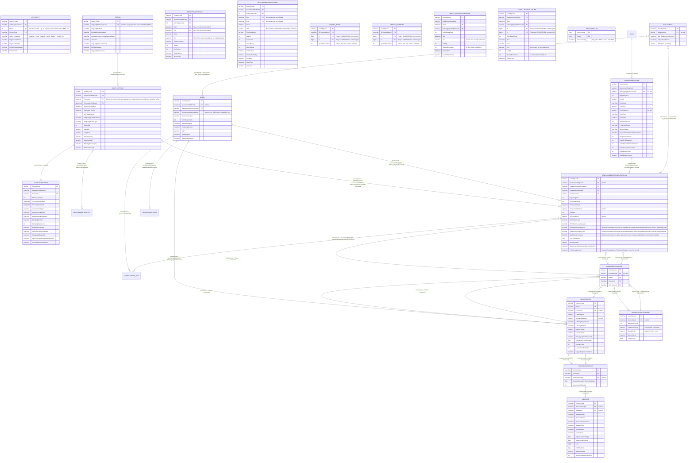

```mermaid
erDiagram

AUTHORITY {
    nvarchar CountryCode PK
    nvarchar AuthorityInstanceId PK
    int Object PK "code list needed, e.g.: ‘1: reporting assessment data to EEA’, etc."
    nvarchar PersonEmail PK
    nvarchar AuthorityInstance "Code list : ‘zone’, ‘network’, ‘nuts0’, ‘station’, ‘model’, etc."
    nvarchar OrganisationName
    nvarchar OrganisationURL
    nvarchar OrganisationAddress
    nvarchar PersonName   
}

STATION {
    varchar CountryCode PK
    nvarchar AirQualityStationEoICode PK "Must be always provided and cannot be modified,​"
    nvarchar AirQualityNetwork
    nvarchar AirQualityNetworkName
    nvarchar AirQualityNetworkOrganisationalLevel
    nvarchar Timezone
    nvarchar AirQualityStationNatCode
    nvarchar AQStationName
    nvarchar AirQualityStationArea
}
STATION ||--o{ SAMPLINGPOINT : "CountryCode + AirQualityStationEoICode"

SAMPLINGPOINT {
    varchar CountryCode PK
    nvarchar AssessmentMethodId PK
    nvarchar ProcessId PK "Can be re-used for the same equipment configurations under different sampling points."
    datetime2 ProcessActivityBegin PK
    datetime2 ProcessActivityEnd
    nvarchar SamplingPointRef
    int AirPollutantCode
    nvarchar AirQualityStationEoICode
    nvarchar AirQualityStationType
    int SuperSite
    numeric Latitude
    numeric Longitude
    numeric Altitude(Masl)
    numeric InletHeight(M)
    numeric BuildingDistance(M)
    numeric KerbDistance(M)
}

SAMPLINGPOINT ||--|| SAMPLINGPROCESS : "CountryCode + ProcessId"
SAMPLINGPOINT }o--o{ MEASUREMENTRESULTS : "CountryCode + AirPollutantCode + AssessmentMethodId"
SAMPLINGPOINT }o--o{ COMPLIANCEASSESSMENTMETHOD : "CountryCode + AirPollutantCode + AssessmentMethodId + DataAggregationProcessId to ProcessId"

SAMPLINGPROCESS {
    varchar CountryCode PK
    nvarchar AssessmentMethodId
    nvarchar ProcessId PK
    int AirPollutantCode
    datetime2 ProcessActivityBegin
	datetime2 ProcessActivityEnd
    nvarchar MeasurementType
    nvarchar MeasurementMethod
    nvarchar MeasurementEquipment
    nvarchar SamplingMethod
    int SamplingEquipment
    nvarchar AnalyticalTechnique
    nvarchar EquivalenceDemonstrated    
    nvarchar DataQualityReportId
    nvarchar EquivalenceDemonstrationReportId
    nvarchar ProcessDocumentationId
}

MEASUREMENTRESULT {
    varchar CountryCode PK
    varchar AssessmentMethodId PK
    int AirPollutantCode PK
    datetime Start PK "time zone must be included"
    datetime End PK "time zone must be included"
    decimal Value
    varchar Unit "Must follow recommended unit for AQD pollutants"
    varchar TimeResolution 
    int Validity
    int Verification
    decimal DataCapture
    datetime ResultTime
}

MEASUREMENTRESULTPNSD {
    varchar CountryCode PK
    varchar AssessmentMethodId PK
    int AirPollutantCode PK
    datetime Start PK "time zone must be included"
    datetime End PK "time zone must be included"
    decimal Value
    varchar Unit "Must follow recommended unit for AQD pollutants"
    varchar TimeResolution 
    int Validity
    int Verification
    int LowerRange
    int UpperRange
    decimal Temperature
    decimal RelativeHumidity
    decimal Pressure  
    datetime ResultTime
    varchar Inversion
}

SRAREA_INLINE {
    varchar CountryCode PK
    nvarchar SR_ApplicationId PK
    bigint X PK "Project SRID3035 EEA common grid"
    bigint Y PK "Project SRID3035 EEA common grid"
    int SpatialResolution "not null, 10, 100, 1000 or 10000 m"    
}

SRAREA_EXTERNAL {
    varchar CountryCode PK
    nvarchar SR_ApplicationId PK
    bigint X PK "Project SRID3035 EEA common grid"
    bigint Y PK "Project SRID3035 EEA common grid"
    int SpatialResolution "not null, 10, 100, 1000 or 10000 m"    
}

MODEL {
    varchar CountryCode PK
    nvarchar AssessmentMethodId PK "not null"
    varchar DataAggregationProcessId PK 
    varchar AssessmentMethodName "not null,e.g.: WRF-Chem, CHIMERE, etc."
    varchar AssessmentType
    int AirPollutantCode
    nvarchar ResultEncoding
    nvarchar ModelApplication
    decimal MQI
    nvarchar ModelReport
    nvarchar DataQualityReport
}
MODEL ||--o{ COMPLIANCEASSESSMENTMETHOD : "CountryCode + AssessmentMethodId + DataAggregationProcessId"
MODEL ||--o{ MODELLINGRESULTS : "CountryCode + AssessmentMethodId + DataAggregationProcessId"
MODEL ||--o{ PLANSCENARIO : "CountryCode + AssessmentMethodId + DataAggregationProcessId"
MODEL ||--o{ SAMPLINGPOINT_SRA : "CountryCode + AssessmentMethodId"

MODELLINGRESULTEXTERNAL {
    varchar CountryCode PK
    varchar AssessmentMethodId PK    
    datetime Start PK
    varchar DataAggregationProcessId PK
    int AirPollutantCode
    datetime End    
    varchar Unit "Use the unit for AQD pollutants"
    int Validity
    int SpatialResolution "10, 100, 1000 or 10000 m"
    datetime ResultTime
    varchar GeoTiffAttachment
}

MODELLINGRESULTINLINE {
    varchar CountryCode PK
    varchar AssessmentMethodId PK    
    datetime Start PK
    varchar DataAggregationProcessId PK
    bigint X PK "Projection SRID3035-EEA common grid"
    bigint Y PK "Projection SRID3035-EEA common grid"
    int AirPollutantCode
    datetime End
    decimal Value
    varchar Unit "Use the unit for AQD pollutants"
    int Validity
    int SpatialResolution "10, 100, 1000 or 10000 m"
    datetime ResultTime
}

ZONEGEOMETRY {
    char CountryCode PK
    char ZoneId PK
    nvarchar ZoneGeometry "Projection: SRID4326 or SRID4258"
}
ZONE ||--o{ ASSESSMENTREGIME : "CountryCode + ZoneId"

ASSESSMENTREGIME {
    varchar CountryCode PK
    varchar AssessmentRegimeId PK
    varchar DataAggregationProcessId PK "not null"
    int ReportingYear
    varchar ZoneId
    nvarchar ZoneCode
    decimal ZoneArea
    varchar ZoneCategory "not null"
    nvarchar ZoneType
    varchar ZoneName
    int AirPollutantCode
    nvarchar ProtectionTarget
    nvarchar ObjectiveType
    nvarchar AssessmentThresholdExceedance
    int PostponementYear
    int FixedSPOReduction
    int ZoneResidentPopulationYear
    int ZoneResidentPopulation
    int ClassificationYear
    varchar ClassificationReport
}
ASSESSMENTREGIME ||--o{ COMPLIANCEASSESSMENTMETHOD : "CountryCode + AssessmentRegimeId + DataAggregationProcessId"


COMPLIANCEASSESSMENTMETHOD {
    varchar CountryCode PK
    varchar AssessmentRegimeId PK "not null"
    nvarchar DataAggregationProcessId PK
    nvarchar AssessmentMethodId PK
    varchar ComplianceId PK
    int ReportingYear
    int AirPollutantCode
    nvarchar AssessmentType
    varchar AssessmentMethod "not null"
    int HotSpot
    varchar IsExceedance "not null"
    decimal AirPollutionLevel
    decimal AirPollutionLevelAdjusted
    decimal AbsoluteUncertaintyLimit "AbsoluteUncertaintyLimit must be reported for every AssessmentMethodId which refer to SamplingPoints"
    decimal RelativeUncertaintyLimit "RelativeUncertaintyLimit must be reported for every AssessmentMethodId which refer to SamplingPoints"
    decimal MaxRatioUncertainty "MaxRatioUncertainty must be reported for every AssessmentMethodId which refers to Model"
    char CorrectionFactor
    varchar AttainmentcId
    nvarchar SamplingPointRepresentativenessAreaId
    nvarchar PreliminaryReason "In case of exceedance ‘PreliminaryReason’ must not be null"
}
COMPLIANCEASSESSMENTMETHOD }o--o{ COMPLIANCEPLANLINK : "CountryCode + PlanId + ScenarioId"
COMPLIANCEASSESSMENTMETHOD }o--o{ SAMPLINGPOINT_SRA : "CountryCode + AssessmentMethodId + SamplingPointRepresentativenessAreaId"


ADJUSTMENT {
    nvarchar CountryCode PK
    varchar AttainmentId PK "not null"
    nvarchar Adj_AssessmentMethodId PK
    nvarchar AdjustmentSource
    decimal MaxRatioUncertainty
}
ADJUSTMENT }o--o{ COMPLIANCEASSESSMENTMETHOD : "CountryCode + AttainmentId + Adj_AssessmentMethodId"
ADJUSTMENT }o--o{ MODEL : "CountryCode + AttainmentId + Adj_AssessmentMethodId"

PLANSCENARIO {
    nvarchar CountryCode PK
    nvarchar PlanId PK
    nvarchar ScenarioId PK "not null"
    varchar PlanCategory
    varchar ScenarioCategory "not null"
    nvarchar AuthorityOrganisation
    nvarchar AuthorityWebsite
    varchar AuthorityLevel
    varchar ScenarioCode
    varchar DataAggregationProcessId
    float ScenarioAirPollutionLevel
    int ScenarioYear
    int AssessmentMethodId
    nvarchar SupportingDocumentation
}
PLANSCENARIO ||--o{ COMPLIANCEPLANLINK : "CountryCode + PlanId + ScenarioId"
PLANSCENARIO ||--o{ COMPLIANCEPLANLINK : "CountryCode + PlanId + ScenarioId"
PLANSCENARIO ||--o{ SCENARIOMEASURE : "CountryCode + PlanId + ScenarioId"

COMPLIANCEPLANLINK {
    varchar CountryCode PK
    varchar ComplianceId PK "not null"
    nvarchar PlanId PK
    nvarchar ScenarioId PK
    nvarchar SourceAppId PK
}
COMPLIANCEPLANLINK ||--o{ PLANSCENARIO : "CountryCode + PlanId + ScenarioId"
COMPLIANCEPLANLINK ||--o{ COMPLIANCEASSESSMENTMETHOD : "CountryCode + PlanId + ScenarioId"
COMPLIANCEPLANLINK ||--o{ SOURCEAPPORTIONMENT : "CountryCode + PlanId + ScenarioId"
COMPLIANCEPLANLINK ||--o{ COMPLIANCEASSESSMENTMETHOD : "CountryCode + SourceAppId to AttainmentId"


MEASURE {
    nvarchar CountryCode PK
    nvarchar MeasureGroupId PK "not null"
    nvarchar MeasureId PK "not null"
    nvarchar MeasureCode
    nvarchar MeasureName
    nvarchar MeasureClassification
    nvarchar MeasureType
    nvarchar SourceSector
    nvarchar SpatialScale
    date ImplementationBegin
    date ImplementationEnd
    bigint Cost
    date FullEffectDate
    varchar MeasureStatus
    int ReasonIfMeasureNotUsed
}

SCENARIOMEASURE {
    nvarchar CountryCode PK
    nvarchar ScenarioId PK
    nvarchar MeasureGroupId PK "not null"
    float MeasureGroupAirPollutionReduction
    int AssessmentMethodId
}
SCENARIOMEASURE ||--o{ PLANSCENARIO : "CountryCode + ScenarioId + MeasureGroupId"
SCENARIOMEASURE ||--o{ MEASURE : "CountryCode + PlanId + ScenarioId"


SOURCEAPPORTIONMENT {
    nvarchar CountryCode PK
    nvarchar SourceAppId PK "not null"
    int AirPollutantCode
    varchar ContributionType "background’, increment, ..."
    varchar SpatialScale "regional, urban, local, ..."
    varchar SourceSector
    float Contribution
}
SOURCEAPPORTIONMENT ||--o{ COMPLIANCEPLANLINK : "CountryCode + SourceAppId to AttainmentId"
```
