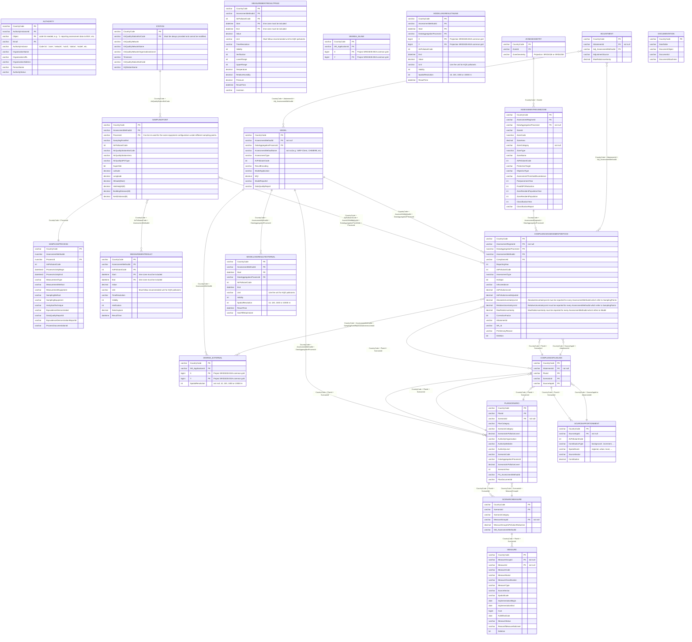

```mermaid
erDiagram

AUTHORITY {
    nvarchar CountryCode PK
    nvarchar AuthorityInstanceId PK
    varchar Object PK "code list needed, e.g.: ‘1: reporting assessment data to EEA’, etc."
    varchar Email PK
    varchar AuthorityInstance "Code list : ‘zone’, ‘network’, ‘nuts0’, ‘station’, ‘model’, etc."
    varchar OrganisationName
    varchar OrganisationURL
    varchar OrganisationAddress
    varchar PersonName
    varchar AuthorityStatus
}

STATION {
    varchar CountryCode PK
    varchar AirQualityStationEoICode PK "Must be always provided and cannot be modified,​"
    varchar AirQualityNetwork
    varchar AirQualityNetworkName
    varchar AirQualityNetworkOrganisationalLevel
    varchar Timezone
    varchar AirQualityStationNatCode
    varchar AQStationName    
}
STATION ||--o{ SAMPLINGPOINT : "CountryCode + AirQualityStationEoICode"

SAMPLINGPOINT {
    varchar CountryCode PK
    varchar AssessmentMethodId PK
    varchar ProcessId PK "Can be re-used for the same equipment configurations under different sampling points."   
    varchar SamplingPointRef
    int AirPollutantCode
    varchar AirQualityStationEoICode
    varchar AirQualityStationArea
    varchar AirQualitySPOType
    bit SuperSite
    decimal Latitude
    decimal Longitude
    decimal Altitude(Masl)
    decimal InletHeight(M)
    decimal BuildingDistance(M)
    decimal KerbDistance(M)
}

SAMPLINGPOINT ||--|| SAMPLINGPROCESS : "CountryCode + ProcessId"
SAMPLINGPOINT }o--o{ MEASUREMENTRESULT : "CountryCode + AirPollutantCode + AssessmentMethodId"
SAMPLINGPOINT }o--o{ COMPLIANCEASSESSMENTMETHOD : "CountryCode + AirPollutantCode + AssessmentMethodId + DataAggregationProcessId + ProcessId"

SAMPLINGPROCESS {
    varchar CountryCode PK
    nvarchar AssessmentMethodId
    nvarchar ProcessId PK
    int AirPollutantCode
    datetime2 ProcessActivityBegin
    datetime2 ProcessActivityEnd
    varchar MeasurementType
    varchar MeasurementMethod
    varchar MeasurementEquipment
    varchar SamplingMethod
    varchar SamplingEquipment
    varchar AnalyticalTechnique
    varchar EquivalenceDemonstrated    
    varchar DataQualityReportId
    varchar EquivalenceDemonstrationReportId
    varchar ProcessDocumentationId
}

MEASUREMENTRESULT {
    varchar CountryCode PK
    varchar AssessmentMethodId PK
    int AirPollutantCode PK
    datetime Start PK "time zone must be included"
    datetime End PK "time zone must be included"
    decimal Value
    varchar Unit "Must follow recommended unit for AQD pollutants"
    varchar TimeResolution 
    int Validity
    int Verification
    decimal DataCapture
    datetime ResultTime
}

MEASUREMENTRESULTPNSD {
    varchar CountryCode PK
    varchar AssessmentMethodId PK
    int AirPollutantCode PK
    datetime Start PK "time zone must be included"
    datetime End PK "time zone must be included"
    decimal Value
    varchar Unit "Must follow recommended unit for AQD pollutants"
    varchar TimeResolution 
    int Validity
    int Verification
    int LowerRange
    int UpperRange
    decimal Temperature
    decimal RelativeHumidity
    decimal Pressure  
    datetime ResultTime
    varchar Inversion
}

SRAREA_INLINE {
    varchar CountryCode PK
    varchar SR_ApplicationId PK
    bigint X PK "Project SRID3035 EEA common grid"
    bigint Y PK "Project SRID3035 EEA common grid"    
}

SRAREA_EXTERNAL {
    varchar CountryCode PK
    varchar SR_ApplicationId PK
    bigint X PK "Project SRID3035 EEA common grid"
    bigint Y PK "Project SRID3035 EEA common grid"
    int SpatialResolution "not null, 10, 100, 1000 or 10000 m"    
}

MODEL {
    varchar CountryCode PK
    varchar AssessmentMethodId PK "not null"
    varchar DataAggregationProcessId PK 
    varchar AssessmentMethodName "not null,e.g.: WRF-Chem, CHIMERE, etc."
    varchar AssessmentType
    int AirPollutantCode
    varchar ResultEncoding
    varchar ModelApplication
    decimal MQI
    varchar ModelReportId
    varchar DataQualityReport
}
MODEL ||--o{ COMPLIANCEASSESSMENTMETHOD : "CountryCode + AssessmentMethodId + DataAggregationProcessId"
MODEL ||--o{ MODELLINGRESULTEXTERNAL : "CountryCode + AssessmentMethodId + DataAggregationProcessId"
MODEL ||--o{ PLANSCENARIO : "CountryCode + AssessmentMethodId + DataAggregationProcessId"
MODEL ||--o{ SRAREA_EXTERNAL : "CountryCode + AssessmentMethodId"

MODELLINGRESULTEXTERNAL {
    varchar CountryCode PK
    varchar AssessmentMethodId PK    
    datetime Start PK
    varchar DataAggregationProcessId PK
    int AirPollutantCode
    datetime End    
    varchar Unit "Use the unit for AQD pollutants"
    int Validity
    int SpatialResolution "10, 100, 1000 or 10000 m"
    datetime ResultTime
    varchar GeoTiffAttachment
}

MODELLINGRESULTINLINE {
    varchar CountryCode PK
    varchar AssessmentMethodId PK    
    datetime Start PK
    varchar DataAggregationProcessId PK
    bigint X PK "Projection SRID3035-EEA common grid"
    bigint Y PK "Projection SRID3035-EEA common grid"
    int AirPollutantCode
    datetime End
    decimal Value
    varchar Unit "Use the unit for AQD pollutants"
    int Validity
    int SpatialResolution "10, 100, 1000 or 10000 m"
    datetime ResultTime
}

ZONEGEOMETRY {
    varchar CountryCode PK
    varchar ZoneId PK
    varchar ZoneGeometry "Projection: SRID4326 or SRID4258"
}
ZONEGEOMETRY ||--o{ ASSESSMENTREGIMEZONE : "CountryCode + ZoneId"

ASSESSMENTREGIMEZONE {
    varchar CountryCode PK
    varchar AssessmentRegimeId PK
    varchar DataAggregationProcessId PK "not null"
    varchar ZoneId
    nvarchar ZoneCode
    decimal ZoneArea
    varchar ZoneCategory "not null"
    nvarchar ZoneType
    varchar ZoneName
    int AirPollutantCode
    varchar ProtectionTarget
    varchar ObjectiveType
    varchar AssessmentThresholdExceedance
    int PostponementYear
    int FixedSPOReduction
    int ZoneResidentPopulationYear
    int ZoneResidentPopulation
    int ClassificationYear
    varchar ClassificationReport
}
ASSESSMENTREGIMEZONE ||--o{ COMPLIANCEASSESSMENTMETHOD : "CountryCode + AssessmentRegimeId + DataAggregationProcessId"


COMPLIANCEASSESSMENTMETHOD {
    varchar CountryCode PK
    varchar AssessmentRegimeId PK "not null"
    nvarchar DataAggregationProcessId PK
    nvarchar AssessmentMethodId PK
    varchar ComplianceId PK
    int ReportingYear
    int AirPollutantCode
    nvarchar AssessmentType   
    bit HotSpot
    varchar IsExceedance 
    decimal AirPollutionLevel
    decimal AirPollutionLevelAdjusted
    decimal AbsoluteUncertaintyLimit "AbsoluteUncertaintyLimit must be reported for every AssessmentMethodId which refer to SamplingPoints"
    decimal RelativeUncertaintyLimit "RelativeUncertaintyLimit must be reported for every AssessmentMethodId which refer to SamplingPoints"
    decimal MaxRatioUncertainty "MaxRatioUncertainty must be reported for every AssessmentMethodId which refers to Model"
    bit CorrectionFactor
    varchar AttainmentId
    varchar SR_Id
    varchar PreliminaryReason
    bit Deletion
}
COMPLIANCEASSESSMENTMETHOD }o--o{ COMPLIANCEPLANLINK : "CountryCode + PlanId + ScenarioId"
COMPLIANCEASSESSMENTMETHOD }o--o{ SRAREA_EXTERNAL : "CountryCode + AssessmentMethodId + SamplingPointRepresentativenessAreaId"


ADJUSTMENT {
    varchar CountryCode PK
    varchar AttainmentId PK "not null"
    varchar Adj_AssessmentMethodId PK
    varchar AdjustmentSource
    decimal MaxRatioUncertainty
}
ADJUSTMENT }o--o{ COMPLIANCEASSESSMENTMETHOD : "CountryCode + AttainmentId + Adj_AssessmentMethodId"
ADJUSTMENT }o--o{ MODEL : "CountryCode + AttainmentId + Adj_AssessmentMethodId"

PLANSCENARIO {
    varchar CountryCode PK
    varchar PlanId PK
    varchar ScenarioId PK "not null"
    varchar PlanCategory
    varchar ScenarioCategory
    decimal ScenarioAirPollutionLevel
    varchar AuthorityOrganisation
    varchar AuthorityWebsite
    varchar AuthorityLevel
    varchar ScenarioCode
    varchar DataAggregationProcessId
    decimal ScenarioAirPollutionLevel
    int ScenarioYear
    varchar PS_AssessmentMethodId
    varchar PlanDocumentId
}
PLANSCENARIO ||--o{ COMPLIANCEPLANLINK : "CountryCode + PlanId + ScenarioId"
PLANSCENARIO ||--o{ COMPLIANCEPLANLINK : "CountryCode + PlanId + ScenarioId"
PLANSCENARIO ||--o{ SCENARIOMEASURE : "CountryCode + PlanId + ScenarioId"

COMPLIANCEPLANLINK {
    varchar CountryCode PK
    varchar AttainmentId PK "not null"
    varchar PlanId PK
    varchar ScenarioId PK
    varchar SourceAppId PK
}
COMPLIANCEPLANLINK ||--o{ PLANSCENARIO : "CountryCode + PlanId + ScenarioId"
COMPLIANCEPLANLINK ||--o{ COMPLIANCEASSESSMENTMETHOD : "CountryCode + PlanId + ScenarioId"
COMPLIANCEPLANLINK ||--o{ SOURCEAPPORTIONMENT : "CountryCode + PlanId + ScenarioId"
COMPLIANCEPLANLINK ||--o{ COMPLIANCEASSESSMENTMETHOD : "CountryCode + SourceAppId + AttainmentId"


MEASURE {
    varchar CountryCode PK
    varchar MeasureGroupId PK "not null"
    varchar MeasureId PK "not null"
    varchar MeasureCode
    varchar MeasureName
    varchar MeasureClassification
    varchar MeasureType
    varchar SourceSector
    varchar SpatialScale
    date ImplementationBegin
    date ImplementationEnd
    bigint Cost
    date FullEffectDate
    varchar MeasureStatus
    varchar ReasonIfMeasureNotUsed
    bit Deletion
}

SCENARIOMEASURE {
    varchar CountryCode PK
    varchar ScenarioId PK
    varchar ScenarioCategory
    varchar MeasureGroupId PK "not null"
    decimal MeasureGroupAirPollutionReduction
    varchar SM_AssessmentMethodId
}
SCENARIOMEASURE ||--o{ PLANSCENARIO : "CountryCode + ScenarioId + MeasureGroupId"
SCENARIOMEASURE ||--o{ MEASURE : "CountryCode + PlanId + ScenarioId"

SOURCEAPPORTIONMENT {
    varchar CountryCode PK
    varchar SourceAppId PK "not null"
    int AirPollutantCode
    varchar ContributionType "background’, increment, ..."
    varchar SpatialScale "regional, urban, local, ..."
    varchar SourceSector
    decimal Contribution
}
SOURCEAPPORTIONMENT ||--o{ COMPLIANCEPLANLINK : "CountryCode + SourceAppId to AttainmentId"

DOCUMENTATION {
	varchar CountryCode PK 
	varchar DataTable
	varchar DocumentObject
	varchar DocumentId
	varchar DocumentAttachmen
}

```
