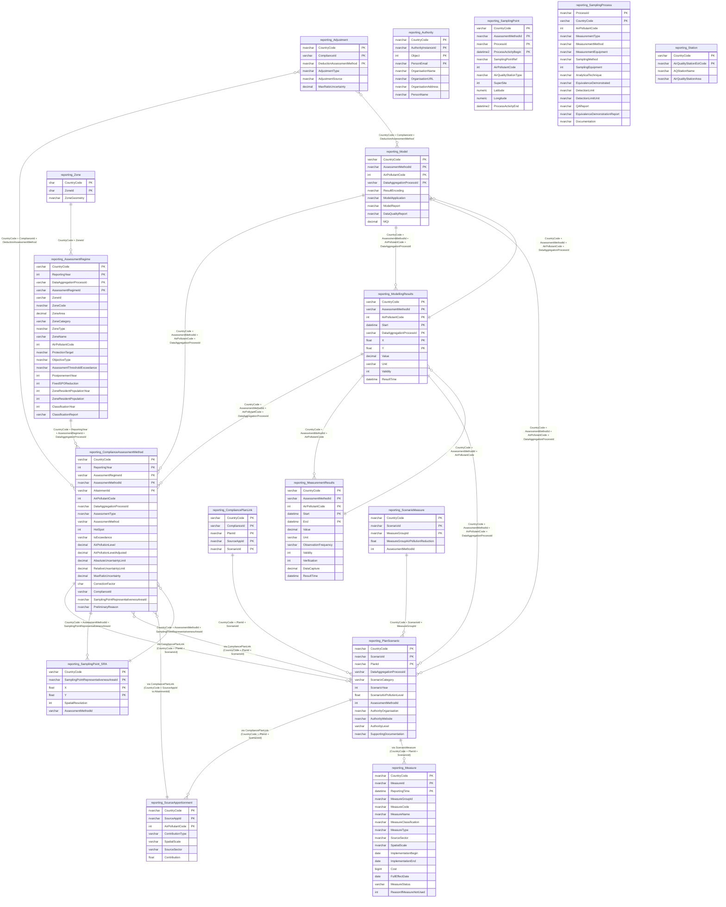

```mermaid
erDiagram
    reporting_Adjustment {
        nvarchar CountryCode PK
        varchar ComplianceId PK
        nvarchar DeductionAssessmentMethod PK
        nvarchar AdjustmentType
        nvarchar AdjustmentSource
        decimal MaxRatioUncertainty
    }
    reporting_Adjustment }o--o{ reporting_ComplianceAssessmentMethod : "CountryCode + ComplianceId + DeductionAssessmentMethod"
    reporting_Adjustment }o--o{ reporting_Model : "CountryCode + ComplianceId + DeductionAssessmentMethod"

    reporting_AssessmentRegime {
        varchar CountryCode PK
        int ReportingYear PK
        varchar DataAggregationProcessId PK
        varchar AssessmentRegimeId PK
        varchar ZoneId
        nvarchar ZoneCode
        decimal ZoneArea
        varchar ZoneCategory
        nvarchar ZoneType
        varchar ZoneName
        int AirPollutantCode
        nvarchar ProtectionTarget
        nvarchar ObjectiveType
        nvarchar AssessmentThresholdExceedance
        int PostponementYear
        int FixedSPOReduction
        int ZoneResidentPopulationYear
        int ZoneResidentPopulation
        int ClassificationYear
        varchar ClassificationReport
    }
    reporting_AssessmentRegime ||--o{ reporting_ComplianceAssessmentMethod : "CountryCode + ReportingYear + AssessmentRegimeId + DataAggregationProcessId"

    reporting_Authority {
        nvarchar CountryCode PK
        nvarchar AuthorityInstanceId PK
        int Object PK
        nvarchar PersonEmail PK
        nvarchar OrganisationName
        nvarchar OrganisationURL
        nvarchar OrganisationAddress
        nvarchar PersonName
    }
    reporting_ComplianceAssessmentMethod {
        varchar CountryCode PK
        int ReportingYear PK
        varchar AssessmentRegimeId PK
        nvarchar AssessmentMethodId PK
        varchar AttainmentId PK
        int AirPollutantCode
        nvarchar DataAggregationProcessId
        nvarchar AssessmentType
        varchar AssessmentMethod
        int HotSpot
        varchar IsExceedance
        decimal AirPollutionLevel
        decimal AirPollutionLevelAdjusted
        decimal AbsoluteUncertaintyLimit
        decimal RelativeUncertaintyLimit
        decimal MaxRatioUncertainty
        char CorrectionFactor
        varchar ComplianceId
        nvarchar SamplingPointRepresentativenessAreaId
        nvarchar PreliminaryReason
    }
    reporting_ComplianceAssessmentMethod ||--o{ reporting_PlanScenario : "via CompliancePlanLink (CountryCode + PlanId + ScenarioId)"
    reporting_ComplianceAssessmentMethod ||--o{ reporting_SamplingPoint_SRA : "CountryCode + AssessmentMethodId + SamplingPointRepresentativenessAreaId"

    reporting_CompliancePlanLink {
        varchar CountryCode PK
        varchar ComplianceId PK
        nvarchar PlanId PK
        nvarchar SourceAppId PK
        nvarchar ScenarioId PK
    }
    reporting_CompliancePlanLink ||--o{ reporting_PlanScenario : "CountryCode + PlanId + ScenarioId"

    reporting_Measure {
        nvarchar CountryCode PK
        nvarchar MeasureId PK
        datetime ReportingTime PK
        nvarchar MeasureGroupId
        nvarchar MeasureCode
        nvarchar MeasureName
        nvarchar MeasureClassification
        nvarchar MeasureType
        nvarchar SourceSector
        nvarchar SpatialScale
        date ImplementationBegin
        date ImplementationEnd
        bigint Cost
        date FullEffectDate
        varchar MeasureStatus
        int ReasonIfMeasureNotUsed
    }
    reporting_MeasurementResults {
        varchar CountryCode PK
        varchar AssessmentMethodId PK
        int AirPollutantCode PK
        datetime Start PK
        datetime End PK
        decimal Value
        varchar Unit
        varchar ObservationFrequency
        int Validity
        int Verification
        decimal DataCapture
        datetime ResultTime
    }
    reporting_MeasurementResults ||--o{ reporting_ModellingResults : "CountryCode + AssessmentMethodId + AirPollutantCode"

    reporting_Model {
        varchar CountryCode PK
        nvarchar AssessmentMethodId PK
        int AirPollutantCode PK
        varchar DataAggregationProcessId PK
        nvarchar ResultEncoding
        nvarchar ModelApplication
        nvarchar ModelReport
        nvarchar DataQualityReport
        decimal MQI
    }
    reporting_Model ||--o{ reporting_ComplianceAssessmentMethod : "CountryCode + AssessmentMethodId + AirPollutantCode + DataAggregationProcessId"
    reporting_Model ||--o{ reporting_ModellingResults : "CountryCode + AssessmentMethodId + AirPollutantCode + DataAggregationProcessId"
    reporting_Model ||--o{ reporting_PlanScenario : "CountryCode + AssessmentMethodId + AirPollutantCode + DataAggregationProcessId"

    reporting_ModellingResults {
        varchar CountryCode PK
        varchar AssessmentMethodId PK
        int AirPollutantCode PK
        datetime Start PK
        varchar DataAggregationProcessId PK
        float X PK
        float Y PK
        decimal Value
        varchar Unit
        int Validity
        datetime ResultTime
    }
    reporting_ModellingResults ||--o{ reporting_ComplianceAssessmentMethod : "CountryCode + AssessmentMethodId + AirPollutantCode + DataAggregationProcessId"
    reporting_ModellingResults ||--o{ reporting_MeasurementResults : "CountryCode + AssessmentMethodId + AirPollutantCode"
    reporting_ModellingResults ||--o{ reporting_Model : "CountryCode + AssessmentMethodId + AirPollutantCode + DataAggregationProcessId"
    reporting_ModellingResults ||--o{ reporting_PlanScenario : "CountryCode + AssessmentMethodId + AirPollutantCode + DataAggregationProcessId"

    reporting_PlanScenario {
        nvarchar CountryCode PK
        nvarchar ScenarioId PK
        nvarchar PlanId PK
        varchar DataAggregationProcessId
        varchar ScenarioCategory
        int ScenarioYear
        float ScenarioAirPollutionLevel
        int AssessmentMethodId
        nvarchar AuthorityOrganisation
        nvarchar AuthorityWebsite
        varchar AuthorityLevel
        nvarchar SupportingDocumentation
    }
    reporting_PlanScenario ||--o{ reporting_ComplianceAssessmentMethod : "via CompliancePlanLink (CountryCode + PlanId + ScenarioId)"
    reporting_PlanScenario ||--o{ reporting_SourceApportionment : "via CompliancePlanLink (CountryCode + PlanId + ScenarioId)"
    reporting_PlanScenario ||--o{ reporting_Measure : "via ScenarioMeasure (CountryCode + PlanId + ScenarioId)"

    reporting_SamplingPoint {
        varchar CountryCode PK
        nvarchar AssessmentMethodId PK
        nvarchar ProcessId PK
        datetime2 ProcessActivityBegin PK
        nvarchar SamplingPointRef
        int AirPollutantCode
        nvarchar AirQualityStationType
        int SuperSite
        numeric Latitude
        numeric Longitude
        datetime2 ProcessActivityEnd
    }
    reporting_SamplingPoint_SRA {
        varchar CountryCode PK
        nvarchar SamplingPointRepresentativenessAreaId PK
        float X PK
        float Y PK
        int SpatialResolution
        varchar AssessmentMethodId
    }
    reporting_SamplingPoint_SRA ||--o{ reporting_ComplianceAssessmentMethod : "CountryCode + AssessmentMethodId + SamplingPointRepresentativenessAreaId"

    reporting_SamplingProcess {
        nvarchar ProcessId PK
        varchar CountryCode PK
        int AirPollutantCode
        nvarchar MeasurementType
        nvarchar MeasurementMethod
        nvarchar MeasurementEquipment
        nvarchar SamplingMethod
        int SamplingEquipment
        nvarchar AnalyticalTechnique
        nvarchar EquivalenceDemonstrated
        nvarchar DetectionLimit
        nvarchar DetectionLimitUnit
        nvarchar QAReport
        nvarchar EquivalenceDemonstrationReport
        nvarchar Documentation
    }
    reporting_ScenarioMeasure {
        nvarchar CountryCode PK
        nvarchar ScenarioId PK
        nvarchar MeasureGroupId PK
        float MeasureGroupAirPollutionReduction
        int AssessmentMethodId
    }
    reporting_ScenarioMeasure ||--o{ reporting_PlanScenario : "CountryCode + ScenarioId + MeasureGroupId"

    reporting_SourceApportionment {
        nvarchar CountryCode PK
        nvarchar SourceAppId PK
        int AirPollutantCode PK
        varchar ContributionType
        varchar SpatialScale
        varchar SourceSector
        float Contribution
    }
    reporting_SourceApportionment ||--o{ reporting_ComplianceAssessmentMethod : "via CompliancePlanLink (CountryCode + SourceAppId to AttainmentId)"

    reporting_Station {
        varchar CountryCode PK
        nvarchar AirQualityStationEoICode PK
        nvarchar AQStationName
        nvarchar AirQualityStationArea
    }
    reporting_Zone {
        char CountryCode PK
        char ZoneId PK
        nvarchar ZoneGeometry
    }
    reporting_Zone ||--o{ reporting_AssessmentRegime : "CountryCode + ZoneId"
```